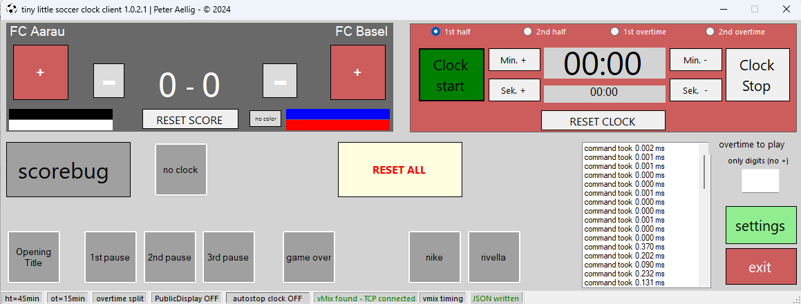
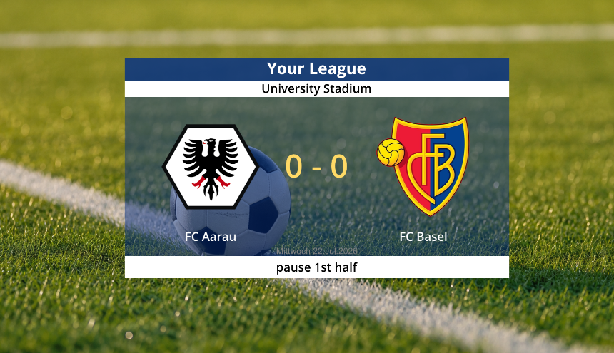
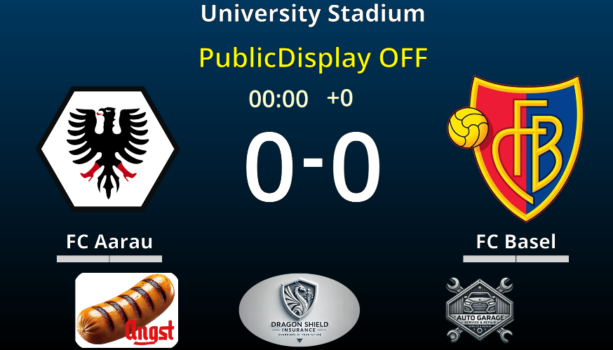
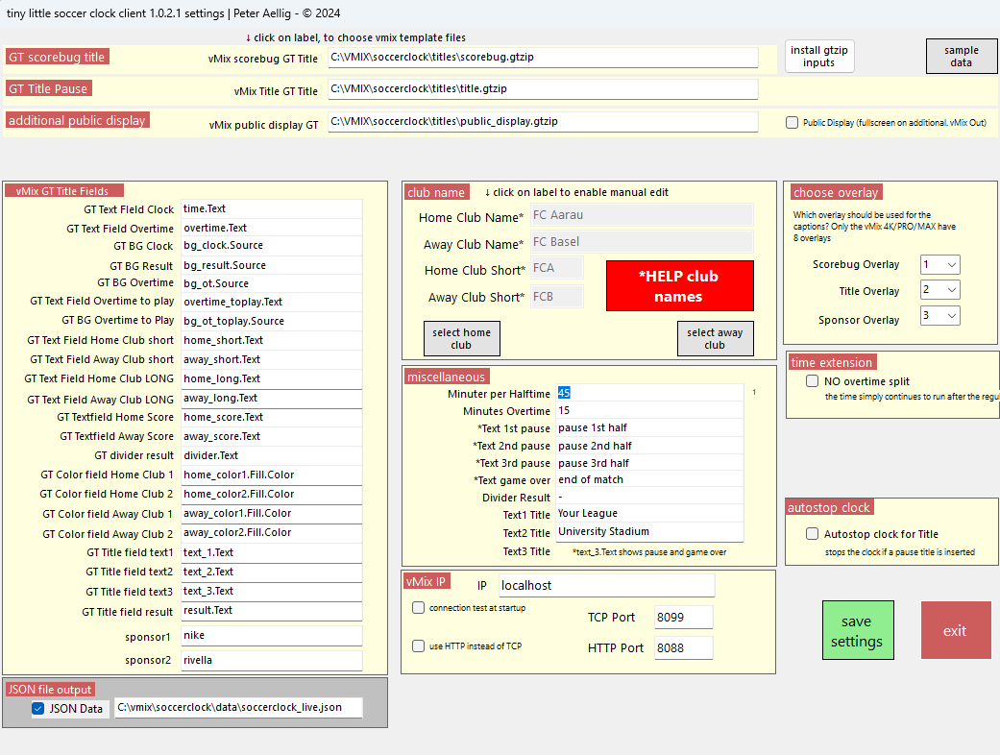
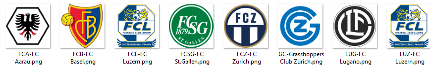

# SOCCERCLOCK

**Live Match Clock for vMix and the Production Team**

One interface. Precise match time. Direct graphics control.

`Windows Forms` · `GT Titles` · `HTTP` · `TCP`

---

## Overview

SoccerClock is a Windows Forms (.NET Framework 4.8) live match-clock application built for broadcast production with vMix. A single operator interface manages the score, the match clock through all four periods, and drives vMix graphics (GT Titles) — while an optional live JSON export makes the same match state available to vMix's own JSON Data Source or any other software that can read a local file.



<table>
<tr>
<td width="33%"></td>
<td width="33%"></td>
<td width="33%"></td>
</tr>
<tr>
<td align="center">Scorebug</td>
<td align="center">Match Title</td>
<td align="center">Public Display</td>
</tr>
<tr>
<td width="33%"></td>
<td width="33%" colspan="2"></td>
</tr>
<tr>
<td align="center">Settings</td>
<td align="center" colspan="2">Club logos — file name = club data, no database</td>
</tr>
</table>

## Documentation

- [Full presentation (English)](https://github.com/peteraellig/SoccerClock/blob/main/Documentation/SoccerClock_vMix_Presentation_EN_with_JSON.pdf)
- [Vollständige Präsentation (Deutsch)](https://github.com/peteraellig/SoccerClock/blob/main/Documentation/SoccerClock_vMix_Praesentation_DE_mit_JSON.pdf)

## The main interface combines score, match clock, and graphics control

Goals, match time, halves, extra time, and graphics are controlled centrally — team names, colors, and the score remain immediately accessible throughout production. Reset Score, Reset Clock, and Reset All cover recovery from an operator mistake without restarting the app.

## Teams are read from a logo directory, not a database

Club logos live under a fixed path, `C:\vmix\soccerclock\logos\`, as transparent 500×500 PNGs named `ShortName-LongName.png` (e.g. `FCB-FC Basel.png`) — SoccerClock reads the short name, long name, and logo directly from the file name. Only clubs with a matching file can be selected; manual entry is also supported for anything not in the directory.

## Settings connect match rules, vMix, and broadcast design

| Section | Covers |
|---|---|
| **vMix** | IP address, HTTP/TCP ports, protocol, and per-content overlay channels (Scorebug/Title/Sponsor — up to 8 overlays on vMix 4K/PRO/MAX) |
| **Match** | Half duration, extra time, auto-stop, and time display (including a continuous "no overtime split" clock) |
| **Content** | Club names, abbreviations, interval/full-time text, and sponsor labels |
| **File Export** | Enable the live JSON export and choose its destination path freely |

Configuration is saved to `soccerclock.xml` and reloaded automatically at the next startup.

## The time logic covers the complete football match sequence

- **Match time** — first and second half, adjustable minutes/seconds, start/stop/reset
- **Extra time** — two extra-time periods with separate stoppage time, or an optional continuous clock that simply keeps counting past regular time
- **Automation** — auto-stop for title cards, automatic period changes, status sent directly to vMix

Every time or score change updates the interface and the connected GT titles.

## GT Titles cover the complete broadcast workflow

`Scorebug` · `Match Title` · `Public Display` · `Sponsor 1/2`

SoccerClock updates text, colors, logos, and visibility directly through the vMix API. The Public Display is a dedicated full-screen GT title (clock, score, logos, sponsors) for a stadium screen or a separate vMix output, toggled independently from the main scorebug.

## Live JSON export

SoccerClock writes the current match state (score, clock, team data, overlay visibility, colors, timestamp) to a local JSON file — no embedded web server, no HTTP endpoint, no extra process. The file is written on every state change plus a heartbeat, so a consumer can tell a real pause apart from a frozen application.

```
Operator            Match State              vMix
SoccerClock GUI ──▶ Clock + Score Store ──▶  HTTP or TCP
                          │
                          ▼
                    JSON file (soccerclock_live.json)
                          │
                          ▼
              vMix JSON Data Source, or any
              other software that reads a file
```

The destination path is freely selectable in Settings; nothing needs to run to consume it besides vMix (or a text editor).

## Repository contents

| Path | Contents |
|---|---|
| [`SoccerClock/`](SoccerClock) | The WinForms application (VB.NET, .NET Framework 4.8) |
| [`vMixAssets/titles/`](vMixAssets/titles) | GT Title templates (`.gtzip`) for vMix |
| [`vMixAssets/logos/`](vMixAssets/logos) | Club logo images |
| [`vMixAssets/advertising/`](vMixAssets/advertising) | Sponsor overlay images |
| [`vMixAssets/fonts/`](vMixAssets/fonts) | Fonts used by the GT Title templates |
| [`vMixAssets/vMix_project/`](vMixAssets/vMix_project) | The vMix project file (`soccerclock.vmix`) |
| [`vMixAssets/data/`](vMixAssets/data) | Runtime data: the live-JSON export |
| [`vMixAssets/setup/`](vMixAssets/setup) | ClickOnce installer output |
| [`Documentation/`](Documentation) | Presentation slides and screenshots (see above) |

See [`vMixAssets/README.md`](vMixAssets/README.md) for how to set these up on a new machine.

## Reliability

- **Responsiveness** — a persistent TCP connection avoids an HTTP handshake for every command; HTTP and TCP senders share the same interface and can be switched live in Settings.
- **Recovery** — a dedicated connection timer checks vMix every second and updates the status, so a transient disconnect self-heals without operator action.
- **Data quality** — the JSON export writes atomically (temp file + rename) and carries a heartbeat, so a consumer can detect a stale or frozen application.

## Production workflow

1. Select teams & colors
2. Set times & overlays
3. Control clock & goals live
4. Output graphics & JSON
5. End and reset the match

The operator focuses on the match while the technical distribution runs in the background.

## Requirements

- Windows, .NET Framework 4.8
- [vMix](https://www.vmix.com/) with GT Titles for graphics output
- Visual Studio (or MSBuild) to build the solution

## At a glance

**1** operator · **2** vMix protocols (HTTP/TCP) · **1** local JSON export, no server required

## License

Copyright (C) 2026 Peter Aellig

This program is free software: you can redistribute it and/or modify it under the terms of the [GNU General Public License, version 3](LICENSE) as published by the Free Software Foundation. Anyone can use, study, share, and build on this project — as long as derivative works stay licensed under GPLv3 too.

---

*Peter Aellig*
